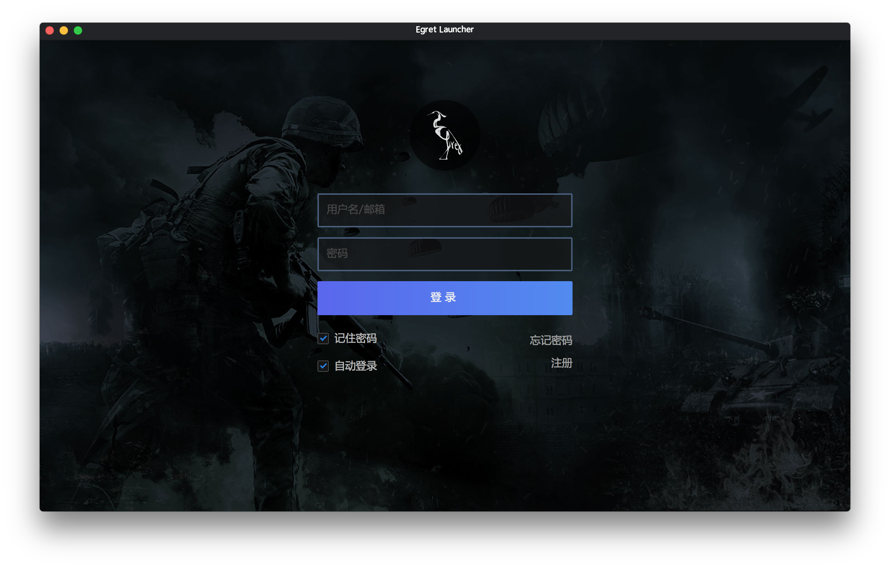
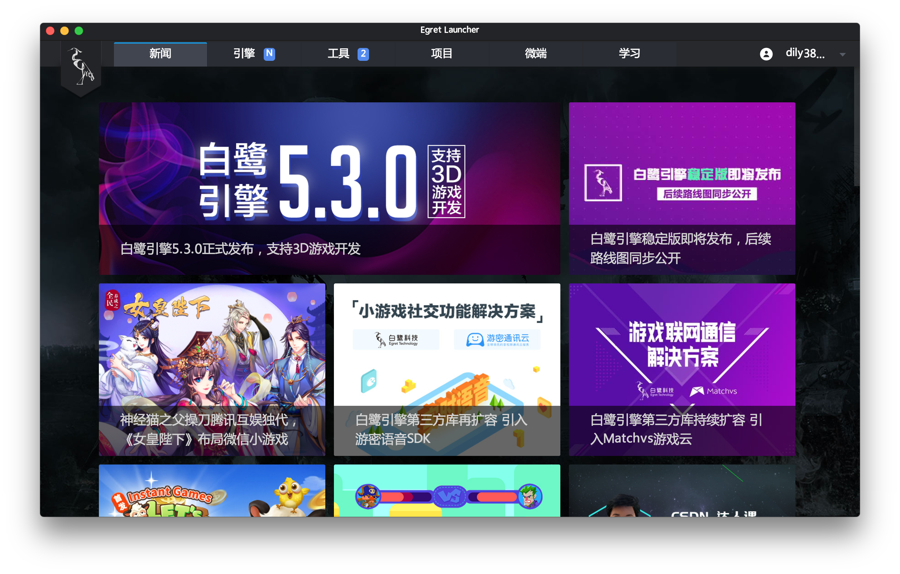
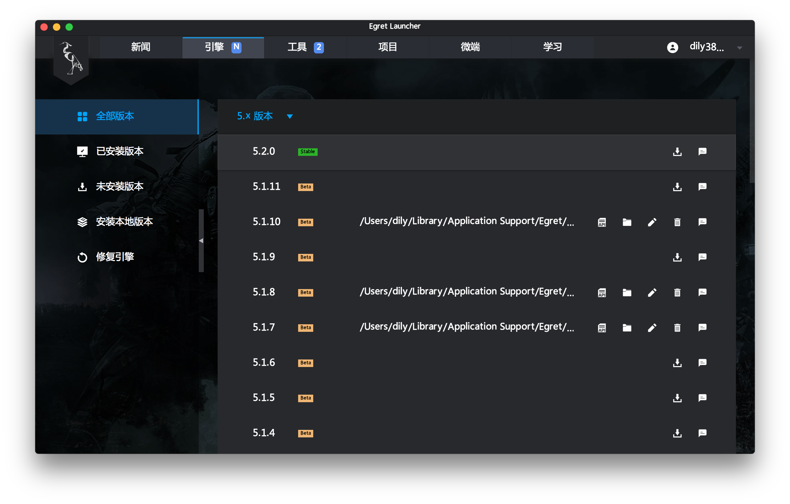
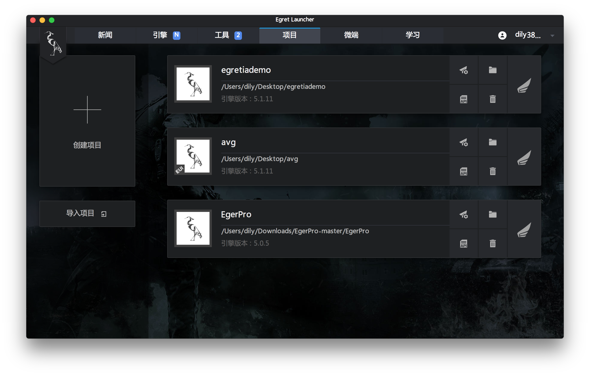
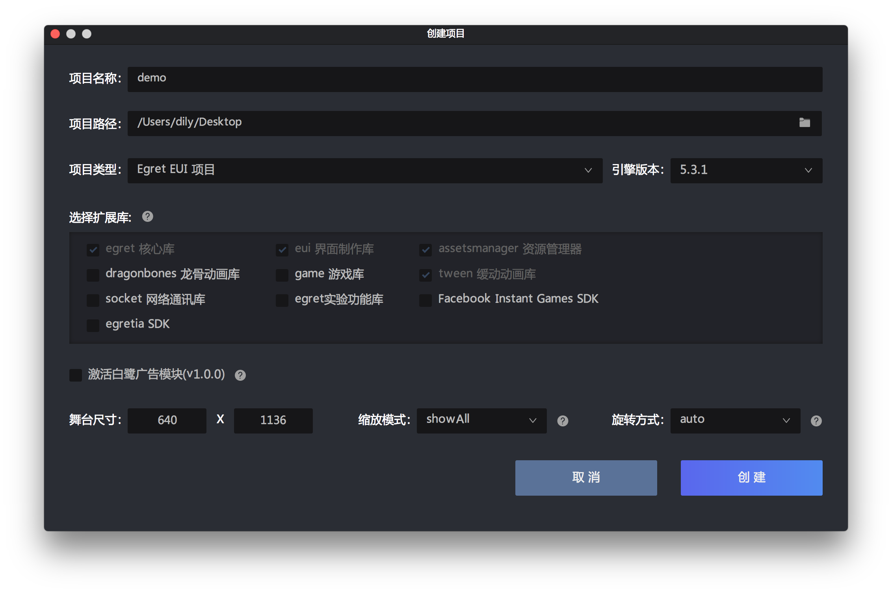

# Egretia 开发环境配置

### 安装 Launcher

下载 [Egret Launcher](http://www.egret.com/products/engine.html),（可参考：[安装与部署](http://developer.egret.com/cn/github/egret-docs/Engine2D/projectConfig/installation/index.html)）。

#### 安装开发工具

打开 Egret Launcher，会显示登录界面，如下图。

登陆成功后会显示 Egret Launcher 主界面。

### 安装 Egret Engine

打开 Launcher 的引擎页面。

点击引擎版本右侧的下载按钮安装引擎最新版本，即可在项目界面创建项目。

点击创建项目

### 安装 Egretia Server

### SmartIDE 使用

